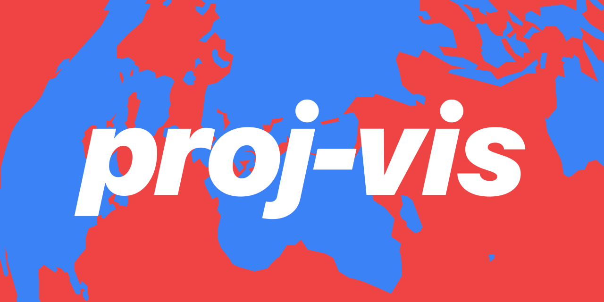

**proj-vis** – A simple web-app tool to quickly visualize what a map projection looks like.

You can find a demo at [proj-vis.leifgehrmann.com](https://proj-vis.leifgehrmann.com/).

## PROJ vs PROJ4

There are two versions of the proj-vis app.

The **demo version** only supports a limited number of projection classes because it uses
[Proj4js](http://proj4js.org), a JavaScript port of the [proj](https://proj.org/) library. The port doesn't require a
web server to transform the coordinates. The list of supported projections classes by alias names can be found [here](https://trac.osgeo.org/proj4js/wiki/UserGuide#Supportedprojectionclasses).

The **full version** supports more projections but requires a web server to transform the coordinates. The server is a
small Python script that uses the real proj library to do the transformations. Supported formats include:
- PROJ string
- JSON string with PROJ parameters
- CRS WKT string
- An authority string (e.g. `epsg:4326`)

### Demo version

The demo version requires npm to be installed.

```
npm ci
npm run dev
```

### Full version

The full version requires npm and docker to be installed.

To start the server, run:

```
npm run proj-vis-server-build
npm run proj-vis-server-run
```

In a new shell, run:

```
export PROJ_VIS_SERVER_URL='http://localhost:7765'
npm ci
npm run dev
```
